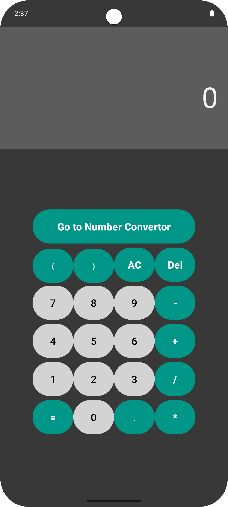
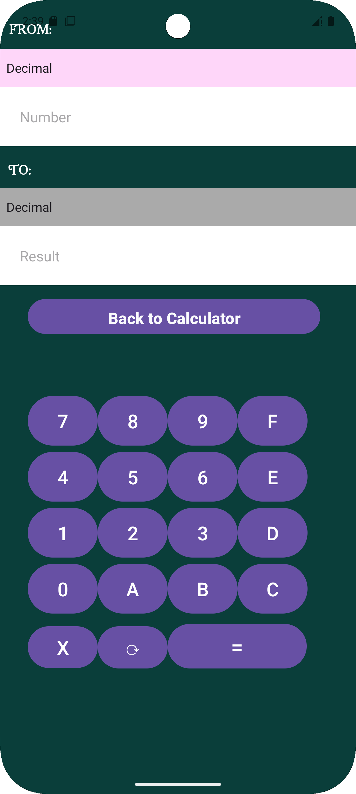

 ## 🔢 Calculator & Number System Converter  

A simple **Android** application built with **Java** that provides:  
1️⃣ **A Basic Calculator** – Performs **Addition, Subtraction, Multiplication, and Division**.  
2️⃣ **A Number System Converter** – Converts between **Binary, Decimal, Hexadecimal, and Octal** number systems.  

Users can easily switch between these two interfaces using a **button with Intent-based navigation**.

---

 ## 🚀 Features 

✅ **Basic Calculator** – Supports fundamental arithmetic operations (+, -, ×, ÷).  
✅ **Number System Converter** – Convert between **Binary, Decimal, Hexadecimal, and Octal**.  
✅ **Easy Navigation** – Switch between calculator and converter using a button (Intent method).  
✅ **Simple UI** – Clean and user-friendly interface.  
✅ **Android-only support**.  

---

## 🛠️ Tech Stack  

- Java (Programming Language)  
- Android Studio (Development Environment)  
- Intents (Navigation) – Used for switching between calculator and converter interfaces.  

---

 ## 📥 Installation  

1. **Clone the repository** 
   ```bash
   git clone https://github.com/NahumDm/Calculator-Converter.git
   cd Calculator-Converter
   ```

2. **Open the project in Android Studio**
   - Launch **Android Studio**
   - Click **Open an existing project**
   - Select **the Calculator-Converter folder**  

3. **Run the app on an emulator or a physical device**  
   - Click the **Run** ▶️ button in Android Studio  

---

## 📸 Screenshots  
<div align="center"> 


</div> 
---

## 📝 License  
This project is open-source under the **MIT License**.  

